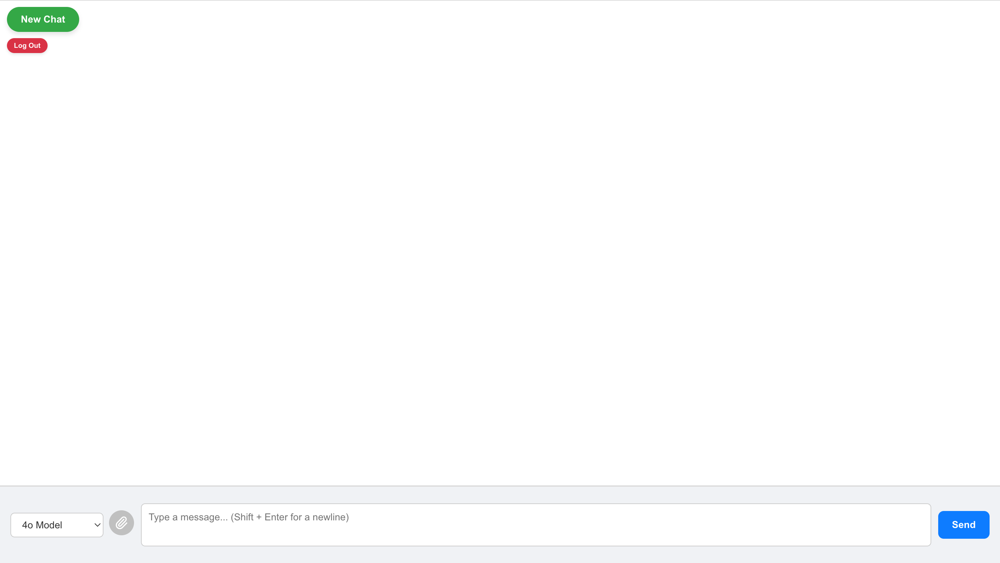
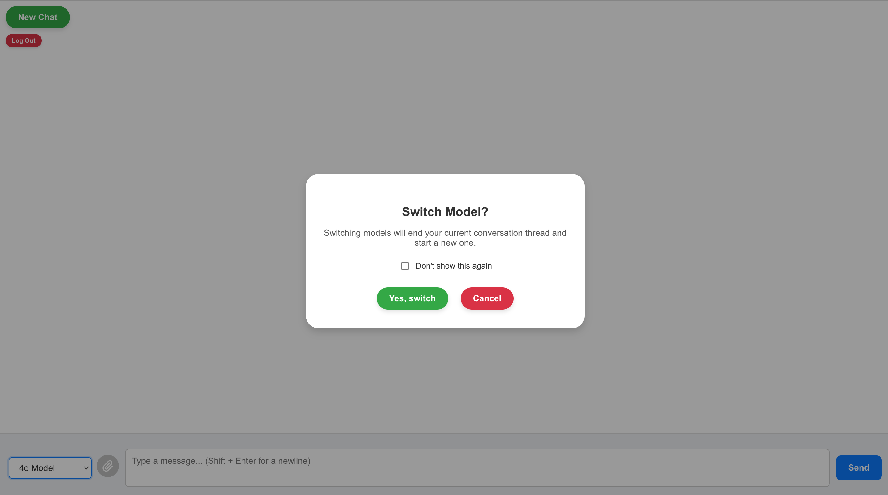

# Skidmore MSCHE Chatbot

## Overview

This chatbot application is designed to assist Skidmore College staff and faculty involved in the MSCHE accreditation review process. It connects to an OpenAI assistant with an attached vector store of the review group’s files and documents uploaded from Box.

With this chatbot, members can:

- Search for files containing specific information
- Upload their own files for better context
- Receive quick clarifications on accreditation-related topics
- Gain new insights to drive the review process

The goal is to provide real impact by saving faculty and staff valuable time while streamlining their workflows.

## Cloud Hosting with Reclaim Cloud

This project is cloud-hosted using [Reclaim Cloud](https://reclaim.cloud/), with a fully containerized setup and automatic HTTPS. Below is an overview of the deployment process:

### Dockerized Architecture

The application consists of:

- **Frontend** (React): Built and served using the `serve` package on port 3000.
- **Backend** (FastAPI): Handles API requests on port 8080.
- **Caddy**: Acts as a reverse proxy and automatically manages SSL certificates via Let's Encrypt.

All services are orchestrated via `docker-compose.yml`.

### Domain & HTTPS

- A public domain is mapped to the environment in Reclaim Cloud.
- HTTPS is managed by **Caddy**, which automatically provisions TLS certificates via Let's Encrypt.
- Caddy routes requests:
  - `/api/*` → backend (FastAPI)
  - everything else → frontend (React)

### Key Caddyfile Configuration

```caddyfile
your-domain.com {
  tls your-email@example.com

  handle_path /api/* {
    reverse_proxy backend:8080
  }

  handle {
    reverse_proxy frontend:3000
  }
}
```

## Frontend Design

<div style="display: flex; gap: 10px; justify-content: start;">
  
  
</div>

The frontend follows a simple, chatbot interface that users will be familiar with and can intuitively work with.

## Technologies

- **Frontend**: React (user interface)
- **Backend**: Python (FastAPI for API handling)
- **SDKs & APIs**:
  - Box (file storage and retrieval)
  - OpenAI Assistant (chatbot processing)
    - The app currently supports a 4o and 4o-mini assistant

## Workflow


This flowchart shows the intended workflow of the project.

1. Users (members of the MSCHE review group) continuously add files to Box
2. Box files are copied to an OpenAI vector store that is attached to an OpenAI assistant
3. Users access the chatbot Okta tile on the Skidmore domain and login using their Skidmore credentials
4. Users prompt the assistant via the frontend UI
5. The assistant generates the response and sends it back to the frontend
6. The UI updates and displays the response to the user
7. Users are free to repeatdely prompt and receive responses from the assistant

## Usage

- Open the chatbot application and enter your query.
- The chatbot will retrieve relevant accreditation documents and provide responses based on uploaded files.

## App Management

### `manage_app.sh` Script for Local Use

This script helps manage the chatbot application locally.

**First-time setup:**
Grant execute permissions by running:

```bash
chmod +x manage_app.sh
```

**Setup the virtual environment (venv)**
If running on a non-externally managed system (Macbook, desktop, etc.), use this:

```bash
source manage_app.sh venv
```

If running on an externally managed system (like a podium computer), use this:

```bash
source manage_app.sh venv podium
```

**Start the application**

```bash
./manage_app.sh start
```

**Stop the application**

```bash
./manage_app.sh stop
```

**End venv**

```bash
deactivate
```

**Notes**

The `venv` function is used to activate the virtual environment, which modifies the current shell session (by adjusting environment variables like `PATH` to point to the virtual environment's Python binaries). This can only be done in the current shell, which is why it must be run using `source`.

On the other hand, `start` and `stop` are functions that can be run as standalone commands (e.g., `./manage_app.sh start`) because they do not modify the shell environment and can be executed in a subshell without affecting the current shell session.

### Containerizing with Docker

This project includes multiple files for containerization using Docker:

- **Two Dockerfiles (`Dockerfile`)**:
  - One for containerizing the frontend
  - One for containerizing the backend
- **One Docker Compose file (`docker-compose.yml`)** located at the root of the project

#### Running the Project in Docker

To build and run the full project using Docker Compose, execute:

```bash
docker compose up --build
```

If you are using an older version of Docker or Docker Compose, use:

```bash
docker-compose up --build
```

#### Prerequisites

- Ensure that [Docker](https://www.docker.com/get-started) is installed and running on your device.
- If using Docker Compose, ensure that you have [Docker Compose](https://docs.docker.com/compose/install/) installed.
  - Docker Compose may already be installed on your machine if you download Docker Desktop, as it is included in the .dmg

#### Additional Notes

- If you need to rebuild images without using the cache, add the `--no-cache` flag:

  ```bash
  docker compose up --build --no-cache
  ```

- To run the containers in detached mode (background):

  ```bash
  docker compose up --build -d
  ```

- To stop and remove the containers, run:

  ```bash
  docker compose down
  ```

  The containers can also be stopped gracefully by typing `Ctrl + C` while they are running

- Logs for each container can be viewed with:

  ```bash
  docker compose logs -f
  ```

## Environment Configuration (.env Files)

The `.env` files for this project store sensitive keys and configuration values required for integrating **Okta Authentication**, the **OpenAI API**, and the **Backend URL** that specifies whether you are working locally or in production. Keeping these environment variables separate from the codebase ensures secure and proper functioning of your application.

### Root File

Create a `.env` file in the **root directory of your project** with the following variables:

```env
REACT_APP_OKTA_ISSUER=your-okta-issuer-url
REACT_APP_OKTA_CLIENT=your-okta-client-id
API_KEY=your-openai-api-key
ASSISTANT_ID_4O_MINI=your-openai-assistant-4o-mini-id
ASSISTANT_ID_4O=your-openai-assistant-4o-id
ORIGIN=your-allowed-origin
```

#### Explanation of Variables

- **REACT_APP_OKTA_ISSUER**: The issuer URL for your Okta authorization server. Find this in the Okta Developer Console under **API** > **Authorization Servers**.
- **REACT_APP_OKTA_CLIENT**: Your Okta client ID, identifying your application for authentication requests. Locate this under **Applications** > **Your App** in the Okta Developer Console.
- **API_KEY**: Your OpenAI API key. Obtain this key by signing up at [OpenAI API](https://beta.openai.com/signup/).
- **ASSISTANT_ID_4O_MINI** / **ASSISTANT_ID_4O**: The IDs of your OpenAI Assistants. Configure these via the OpenAI platform or API.
- **ORIGIN**: The allowed origin used for configuring `CORSMiddleware`. This should match your environment (local or production).

### React Frontend Files

Use `.env.production` and `.env.deployment` files in the React frontend directory to **set the Backend URL for production and deployment environments**. Example content:

```env
REACT_APP_BACKEND_URL=your-local-or-production-backend-url
```

### Purpose of Environment Files

- **.env**: Used for your local development environment.
- **.env.production** / **.env.deployment**: Specify backend URLs for production and deployment builds. The application will automatically select the correct environment file based on whether you use the `manage_app.sh` script (`npm start`) or build with Docker (`npm run build`).

## Setting the Chatbot Up For Yourself

Follow these steps as necessary for setting up the application for yourself.

### Setting up the repository

1. Clone the repo

   ```bash
   https://github.com/jgoldsmith27/vector-store-chatbot.git
   ```

2. Set up React / install dependencies as needed

3. Create the `.env` files as described in the [.env section](#environment-configuration-env-files). Most likely, you can only add `API_KEY` for now in the root `.env` file and the `REACT_APP_BACKEND_URL` in the `.env.development` in the `frontend` directory. Additionally, you can set `ORIGIN` to `http://localhost:3000` on your local version of the repository if you want to eventually run the application there (for testing and development purposes).

4. If you don't already have the assistants created, you will need to setup a few things before you can get the script to create them fully functional.

#### Setting up Box

1. Navigate to your Box account and click the **(</>)** button on the bottom left corner of the screen—this directs you to the Developer Console. If this button doesn't exist for you, you will need to login to this externally.

2. If your **Box App** doesn't exist already, hit **Create Platform App** to create one.

3. Select **Custom App**.

4. Fill in the fields (Name, Description, etc.) as desired/needed and continue to the next page.

5. Any authentication method should work, but we selected **OAuth2.0**. Create the app.

6. Navigate to the configuration tab and scroll down to the **Developer Token** section. Hit the **Generate Developer Token** button. This token will be used to access your Box account programatically.

7. Next, go back to your regular Box profile. Navigate to the folder you wish to read from. Look at the URL and copy the number after `folder/` and before `?` (if there is a query parameter). This is the ID number of the folder

### Setting up the repository (continued)

5. Open `create_store_and_assistant.py` and pass the folder ID as the parameter into the `get_pdf_file_streams` function.

6. Additionally, you will need to add your own assistant instructions file (currently listed as `MSCHE_Chatbot_Instructions.md` in the script) in this subdirectory (you may also change the name of the file if you like for clarity).

7. Run `create_store_and_assistant.py` and paste your **Developer Token** into the terminal when prompted.

8. Wait for the program to finsih execution. Depending on the number of files you read and the number of assistants you create this can take anywhere from a few minutes to longer. For our purposes, reading roughly 250 files and creating 2 assistants with the vector stores attached took around 15 minutes. Increasing the size of each batch uploaded to the vector stores can speed this up, but if this gets too large, you run the risk of more file failing to upload (this statistic is presented to you in the terminal, and to our knowledge, we are not sure exactly why a file would fail to be uploaded).

9. Copy the assistant IDs logged to the terminal upon the script's execution to the `ASSISTANT_ID_4O_MINI` and `ASSISTANT_ID_4O` variables of the root `env.` file.

### Setting up Docker

Ensure you **Docker** and **Docker Compose** installed—they are crucial for containerizing the application. See the links and info [here](#prerequisites) for help.

### Setting up Okta Authentication

If you don't already have your **Okta Authentication App** set up with your `OKTA_ISSUER` and `OKTA_CLIENT` variables initialized:

1. Navigate to **Okta Developer** Home and either log-in with your email (if you think/know your email has a **Okta Developer Account** associated with it) or sign-up.

2. If signing up, click the button that says **Sign up free for Developer Edition** and fill in your information.

3. Once your on the page of your **Okta Organization**, navigate to **Applications > Applications** and hit **Create App Integration**.

4. Select **OIDC - OpenID Connect** as your sign-in method and **Single-Page Application** as your application type.

5. Fill in the **App integration name** field.

6. In the **Sign-in redirect URIs** and the **Sign-out redirect URIs** sections click **+Add URI** and add `http://localhost:3000/login/callback` and `http://localhost:3000` respectively. This is necessary if you wish to view the application locally and/or want to make your local machine your development environment.

7. In the **Assignments** section, select **Allow everyone in your organization to access** and then in the **Enable immediate access** section that pops down, make sure **Federation Broker Mode** is enabled. Save your changes.

8. Fill in your `OKTA_ISSUER` and `OKTA_CLIENT` variables in the root `.env` (see the [.env section](#environment-configuration-env-files) for help).

At this point, if you wish to run the app locally to ensure everything is working, see the section on [running the app locally](#manageappsh-script-for-local-use) to do so.

### Setting Up Reclaim Cloud

If you are using **Reclaim Cloud** as your hosting provider, follow these steps:

1. Navigate to **Reclaim Cloud** and log-in to your dashboard.

2. Click the **+New Environment** button at the top.

3. Click the **Custom** option at the top of the modal and select **Docker Engine**.

4. Select **Deploy containers from `compose.yml`** and include the link to the repo.

5. Change the **Environment**, **Display Name**, and **Region** as desired and create the new environment.

6. Select the drop down arrow on your new environment in the dashboard and navigate to the 🔧 **Config** option.

7. Navigate to `root/application` (the repository) and fill in the remaining environment variables. This includes:

- `REACT_APP_BACKEND_URL` in the `.env.production` in the `frontend` directory. This is your new domain + `/api` (the path to the backend).
- `ORIGIN` in the root `.env`. This is your new domain.

8. In the dashboard, select the drop down arrow on your new environment in the dashboard and navigate to the 🔧 **Web SSH** option.

9. Run:

   ```bash
   cd application
   ```

   and then:

   ```bash
   docker compose up --build -d
   ```

   to build the containers. The more "changes" that aren't cached from previous builds, the longer this will take—since this is the first time, everything needs to be built from scratch and it will take a long time. For us, this can take up to 15 minutes. If it seems this process is snagged (especially when running `npm run build` or the step right after), terminate the process (`Ctrl + C`) and run it again. See the [docker additional notes section](#additional-notes) for more info on **Docker** and **Docker Compose** commands.

10. You will see success messages indicating that the **frontend**, **backend**, and **caddy** containers were successfully built. When you access the URL of your application, the log-in page/chatbot should display properly!

## Future Work

The goal is to make the chatbot accessible as a **tile on Skidmore’s Okta platform**, allowing review group members to log in through Okta authentication.

Next steps include:

- **Enhanced AI capabilities**: Improve document retrieval accuracy and chatbot responses.
- **User feedback**: Collect feedback from faculty/staff to refine usability.
- **Improve UX**: Enhance the design and functionality of the chatbot to maximize the user experience

Check the **GitHub Issues** page to see new features planned for the application and what is currently being worked on.

```

```
