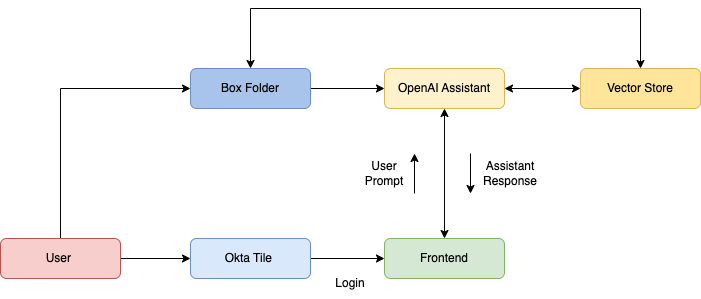

# Skidmore MSCHE Chatbot

## Overview

This chatbot application is designed to assist Skidmore College staff and faculty involved in the MSCHE accreditation review process. It connects to an OpenAI assistant with an attached vector store of the review group’s files and documents uploaded from Box.

With this chatbot, members can:

- Search for files containing specific information
- Receive quick clarifications on accreditation-related topics
- Gain new insights to drive the review process

The goal is to provide real impact by saving faculty and staff valuable time while streamlining their workflows.

## Technologies

- **Frontend**: React (user interface)
- **Backend**: Python (FastAPI for API handling)
- **SDKs & APIs**:
  - Box (file storage and retrieval)
  - OpenAI Assistant (chatbot processing)
    - (The assistant runs on gpt-4o-mini)

## Workflow



This flowchart shows the intended workflow of the project.

1. Users (members of the MSCHE review group) continuously add files to Box
2. Box files are copied to an OpenAI vector store that is attached to an OpenAI assistant
3. Users access the chatbot Okta tile on the Skidmore domain and login using their Skidmore credentials
4. Users prompt the assistant via the frontend UI
5. The assistant generates the response and sends it back to the frontend
6. The UI updates and displays the response to the user
7. Users are free to repeatdely prompt and receive responses from the assistant

## Usage

- Open the chatbot application and enter your query.
- The chatbot will retrieve relevant accreditation documents and provide responses based on uploaded files.

## App Management

### `manage_app.sh` Script for Local Use

This script helps manage the chatbot application locally.

**First-time setup:**  
Grant execute permissions by running:

```bash
chmod +x manage_app.sh
```

**Setup the virtual environment (venv)**
If running on a non-externally managed system (Macbook, desktop, etc.), use this:

```bash
source manage_app.sh venv
```

If running on an externally managed system (like a podium computer), use this:

```bash
source manage_app.sh venv podium
```

**Start the application**

```bash
./manage_app.sh start
```

**Stop the application**

```bash
./manage_app.sh stop
```

**End venv**

```bash
deactivate
```

**Notes**

The `venv` function is used to activate the virtual environment, which modifies the current shell session (by adjusting environment variables like `PATH` to point to the virtual environment's Python binaries). This can only be done in the current shell, which is why it must be run using `source`.

On the other hand, `start` and `stop` are functions that can be run as standalone commands (e.g., `./manage_app.sh start`) because they do not modify the shell environment and can be executed in a subshell without affecting the current shell session.

## Future Work

The goal is to make the chatbot accessible as a **tile on Skidmore’s Okta platform**, allowing review group members to log in through Okta authentication.

Next steps include:

- **Okta integration**: Implement single sign-on (SSO) for user authentication.
- **Enhanced AI capabilities**: Improve document retrieval accuracy and chatbot responses.
- **User feedback**: Collect feedback from faculty/staff to refine usability.

Check the **GitHub Issues** page to see new features planned for the application and what is currently being worked on.
